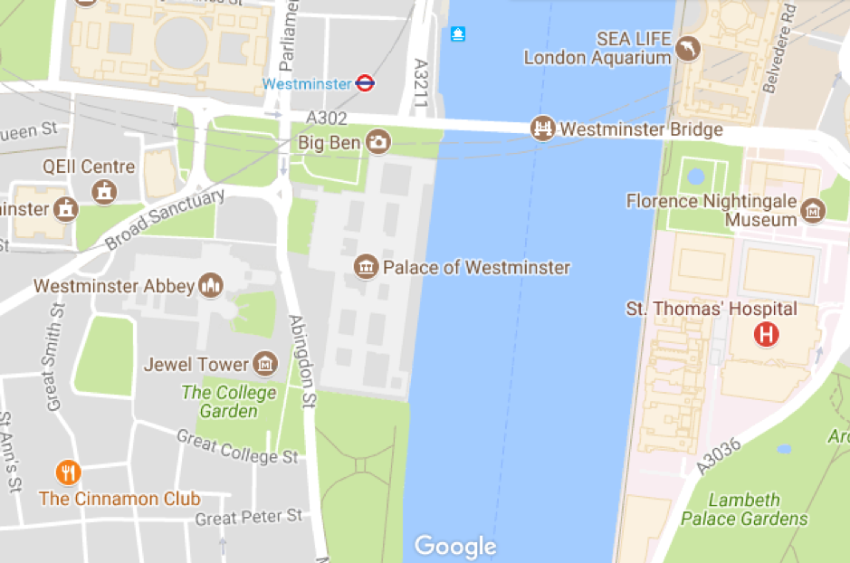
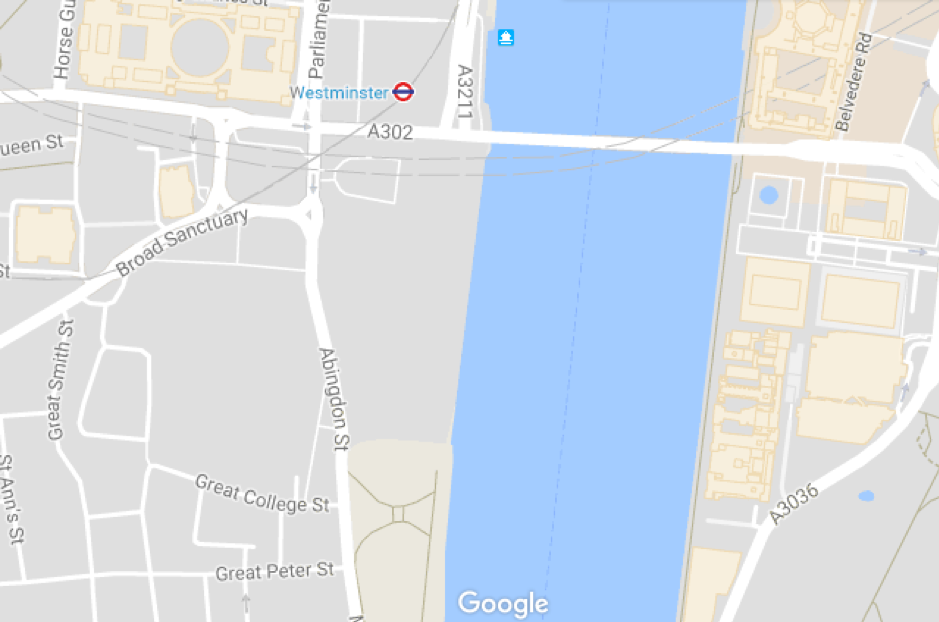
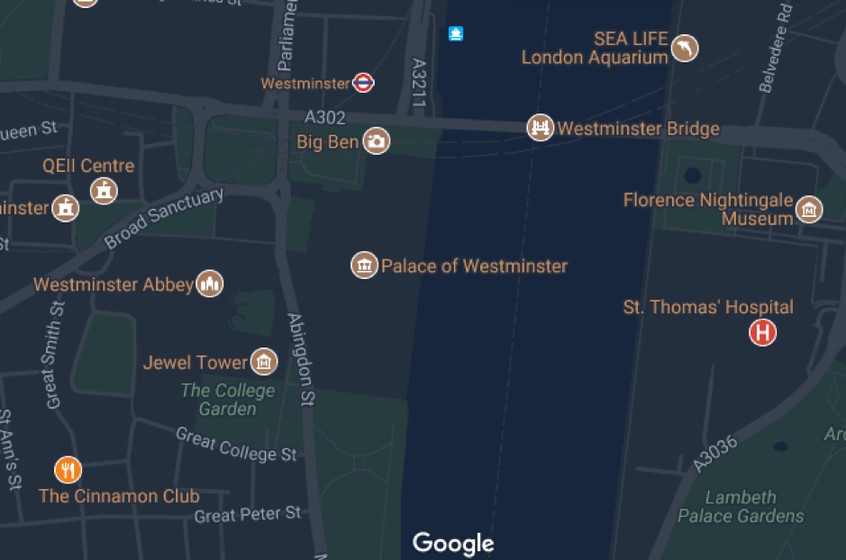
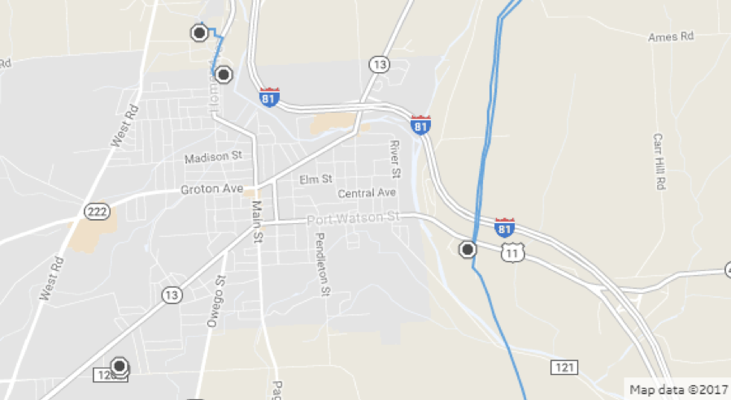
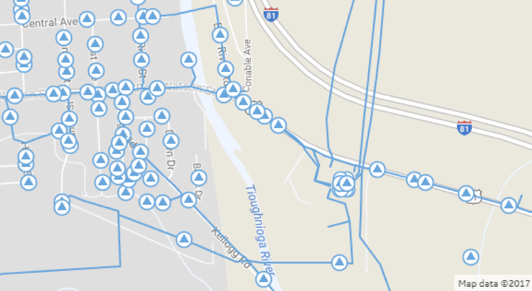
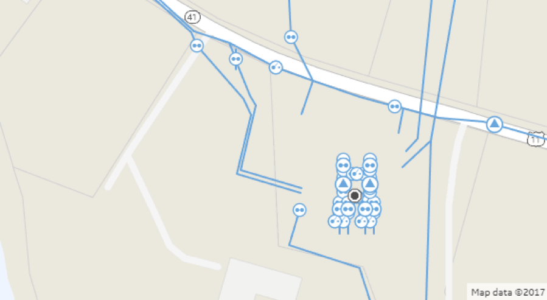

<style>
  .gif {
    width: 100%;
    margin-top: .25rem;
  }
</style>

# Overview
Px-map is a lightweight framework for building interactive maps with web
components and Polymer. The framework includes a base mapping component (`<px-map>`)
that can be used with many different subcomponents to solve common mapping UI
problems, like plotting geographic data.

## What's under the hood

The current major release of px-map uses the open source [Leaflet](http://leafletjs.com/)
library to support displaying a map with base tiles and geospatial overlays.
Future iterations of the component may offer the ability to use a different
library in place of Leaflet, while keeping the same basic API.

## What you can do with px-map

Out of the box, `px-map` includes the basic things needed to draw and plot data
on an interactive map. It is also extensible — development teams are encouraged
to build their own subcomponents that add features needed for their application.
We currently do not support visualizations, but any open source Leaflet plugin
can be easily converted to be a px-map custom layer.

# Basic concepts

Use the map to plot geographic data such as individual assets or clusters of
assets and information about them. The data concepts underlying the map include:

- **Base layer:** The base layer of a map renders tile images that include
information such as streets, mountains, and national parks. For example,
satellite, terrain, and map view are all different base layer styles.
- **Overlay:** Information that is put on top of a map's base layer that is
specific to the purpose of that map. For example, traffic data or bike lane
information might be set as an overlay on a road map.
- **Control:** A map layer that allows the user to manipulate the map, e.g. by
zooming in, out, or to their current location.
- **CRS (Coordinate Relationship System/Coordinate Projection System):** A
framework for defining real-world locations that attempts to reconcile the geoid
shape of the earth with the two-dimensional plane of a map.
[As described by ArcGIS](http://desktop.arcgis.com/en/arcmap/10.3/guide-books/map-projections/what-are-map-projections.htm),
a CRS may either be "geographic (in which spherical coordinates are measured
from the earth's center) or planimetric (in which the earth's coordinates are
projected onto a two-dimensional planar surface)."

## Graphic: map layers

# Subcomponents

The following subcomponents are available for use with px-map:

**Base map**

- `<px-map>`: Draws the underlying map, sets location/zoom and notifies updates
when the user interacts with the map, enables and disables interactions,
orchestrates subcomponents

**Tile layers**

- `<px-map-tile-layer>`: Calls a tile service API to fetch underlying tile images
for the map
- `<px-map-tile-layer-bing>`: Calls the Bing Maps API to fetch underlying tile
images for the map
- `<px-map-tile-layer-google>`: Calls the Google Maps API to fetch underlying
tile images for the map
- `<px-map-tile-layer-wms>`: Displays WMS services as tile layers on the map.

**Overlay/visualization layers**

- `<px-map-layer-geojson>`: Draws GeoJSON data as vectors on the map
- `<px-map-layer-group>`: Groups related overlays together to allow for bulk
interactions (e.g. hide all in the group)
- `<px-map-marker-static>`: Creates a marker that shows the state of a point/asset
(e.g. with color)
- `<px-map-marker-symbol>`: Creates a marker with an icon that shows the state
of a point/asset
- `<px-map-marker-locate>`: Creates a marker that represents the user's location
- `<px-map-marker-group>`: Draws many markers in clusters, useful for visualizing
thousands of points that can be dynamically updated

**UI components**

- `<px-map-popup-info>`: Binds a popup that can include text or an image to a marker
- `<px-map-popup-data>`: Binds a popup that can include text and key/value data
to a marker

**Controls**

- `<px-map-control-zoom>`: Adds zoom buttons the user can tap to zoom in or out
of the map
- `<px-map-control-scale>`: Adds a scale that shows the distance of an area on
the map in miles/kilometers
- `<px-map-control-locate>`: Adds a button the user can tap to locate themselves
on the map and center the map on their location

# Set up in your app

## Choosing a CRS
As described above, a CRS is a coordinate reference system used to project
geographical points into pixel coordinates. The CRS can only be set once before
the map is first initialized. px-map defaults to the most common web mapping
projection [EPSG 3857](https://epsg.io/3857). Most use cases do **not** require
changing the default CRS being used by px-map, and we strongly recommend using
the default. If your customers give you data in a different projection system,
you can either (1) re-project that data to our CRS (recommended), or (2) set the CRS
on the map to the same one being used by your data with the `crs` property on
px-map.

## Choosing a base map provider

Typically, a map will display your data against a base map, such as a road map
or satellite imagery.  This base map is a set of map tiles that are pieced
together by the map to provide a seamless backdrop. Despite the almost ubiquitous
presence of base map tiles in maps, access to use them is not free. The data
contained within the base map tiles is generally copyrighted and requires a fee
for use. Large scale map providers like Google and Bing provide free access to
map tiles for development purposes, but there is usually a usage limit which
prevents developers from deploying them in production applications.

Even for data providers like OpenStreetmap (OSM) that provide access to copyright-free
data, there is usually a charge to cover the costs of maintaining the tile servers
that manage and provide the individual tiles.

Px-map provides support for OSM, Bing, and Google, provided that you have an
appropriate usage key. Fees are typically calculated based on the number of tile
requests your application will make over a given period, normally a month.
Budgeting for this expense can be difficult as you need to understand the number
of map tile requests an individual user is likely to make per month and extrapolate
this based on the number of users you expect to use the app per month. As the tiles
are a fixed size, the size of the map in the application will dictate the number
of tiles needed to cover it.

It is also worth noting that map tile providers may impose additional constraints
on how you can use the map tiles in your application. The providers may prevent
you caching the tiles when the device is offline, or require that you display
their attribution within the map. Always make sure you review and understand the
terms and conditions of your agreement with the map tile provider.

**Base map styling**

Base map providers typically have more than one base map style, so you can choose
one that shows the information that you need, styled in a way that shows off your
data.

Standard Google Maps style:



Google Maps with points of interest turned off:



Google Maps with a dark theme:




**Tile service options**

Most px-map demos use the OpenStreetMap public tile service to serve map tiles
(e.g. `https://{s}.tile.openstreetmap.org/{z}/{x}/{y}.png`) with the
px-map-tile-layer subcomponent. This tile service is used for demo purposes only.
**You should not use this tile service for production applications; you will
need to implement or purchase your own tile service.**

The [OpenStreetMap Tile Usage Policy](https://operations.osmfoundation.org/policies/tiles/)
details specific restrictions for developers using their public tile service.
These restrictions include the following provision: "Heavy use (e.g. distributing
an app that uses tiles from openstreetmap.org) is forbidden without prior
permission." If you choose to use the OpenStreetMap service for demos or development,
you should likely replace the service URLs when your app is shipped to production.

The following list of companies provide tile service APIs that may be free or
paid and should be compatible with the `px-map-tile-layer` (note that these are
not endorsed, but just offered as options):

  - [Mapbox](https://www.mapbox.com/help/how-mapbox-data-works/)
  - [Carto](https://carto.com/location-data-services/basemaps/)
  - [Mapzen](https://mapzen.com/products/maps/)


You can also use the `px-map-tile-layer-bing` component to load map tiles from
the Bing API, the `<px-map-tile-layer-google>` component to load map tiles from
the Google Maps API, or the `<px-map-tile-layer-wms>` component to display WMS
services as tile layers on the map.

## Example: creating a px-map in your application

<iframe height='480' scrolling='no' title='px-map-demo'
src='//codepen.io/talimarcus/embed/BYxyNb/?height=265&theme-id=0&default-tab=html,result&embed-version=2'
frameborder='no' allowtransparency='true' allowfullscreen='true' style='width: 100%;'></iframe>

# Understanding GeoJSON

GeoJSON is a JSON-based format used to represent a variety of geographic data
structures. You can use GeoJSON to represent geometry (e.g. Points, Polygons),
features, or feature collections. GeoJSON is always composed of a single object,
and that object must have a member with the name "type." The type refers to the
type of GeoJSON object and must be one of: `"Point"`, `"MultiPoint"`, `"LineString"`,
`"MultiLineString"`, `"Polygon"`, `"MultiPolygon"`, `"GeometryCollection"`,
`"Feature"`, or `"FeatureCollection"`.

**Geometry Objects**

All Geometry objects (aside from a `"GeometryCollection"`) must have a member
with the name `"coordinates"`, the value of which is an array (or array of arrays)
of latitude and longitude coordinates **in `[lng, lat]` order**.
- **Point:** A Point is a single point on a map which has no area and can be
defined by its latitude and longitude coordinates, e.g.:
  ```json
  {
    "type": "Point",
    "coordinates": [0, 0]
  }
  ```
- **Polygon:** A Polygon represents an area on a map and is defined by an array
of four or more latitude and longitude coordinate arrays (positions). Note that
the first and last positions MUST be identical, e.g.:
  ```json
  {
    "type": "Polygon",
    "coordinates": [
      [
        [0, 0], [10, 10], [10, 0], [0, 0]
      ]
    ]
  }
  ```

**Feature Objects**

A Feature allows you to describe a Geometry with a set of properties. A Feature
object must have the type `"Feature"`, as well as `"geometry"` and `"properties"`
members. E.g.:
  ```json
    {
      "type": "Feature",
      "properties": {
          "name": "M. A. Chidambaram Stadium",
          "sport": "Cricket",
          "team": "Chennai Super Kings"
      },
      "geometry": {
          "type": "Point",
          "coordinates": [80.2792802, 13.0628075]
      }
    }
  ```

**Feature Collection Objects**

A Feature Collection is simply a collection of individual Features. A Feature
Collection object must have the type `"FeatureCollection"`, as well as member
with the name `"Feature"` whose value is an array of Feature objects, e.g.:
```json
{
  "type": "FeatureCollection",
  "features": [{
    "type": "Feature",
    "properties": {
        "name": "Fenway Park",
        "sport": "Baseball",
        "team": "Boston Red Sox"
    },
    "geometry": {
        "type": "Point",
        "coordinates": [-71.09938384, 42.3466789]
    }
  },
  {
    "type": "Feature",
    "properties": {
        "name": "Groupama Stadium",
        "sport": "Football",
        "team": "Olympique Lyonnais"
    },
    "geometry": {
        "type": "Point",
        "coordinates": [4.9798403, 45.765295]
    }
  },
  {
    "type": "Feature",
    "properties": {
        "name": "Hillsborough Stadium",
        "sport": "Football",
        "team": "Sheffield Wednesday F.C."
    },
    "geometry": {
        "type": "Point",
        "coordinates": [-1.5006631, 53.4114317]
    }
  },
  {
    "type": "Feature",
    "properties": {
        "name": "Oracle Arena",
        "sport": "Basketball",
        "team": "Golden State Warriors"
    },
    "geometry": {
        "type": "Point",
        "coordinates": [-122.2030494, 37.7502917]
    }
  }]
}
```
See the [GeoJSON spec](http://geojson.org/geojson-spec.html) for more guidance
on generating valid GeoJSON.

# Defining FeatureCollections and Features in a px-map-marker-group

The `data` attribute on `px-map-marker-group` expects a GeoJSON feature collection
with specific settings configured to draw each marker.

## FeatureCollection Format

The root JavaScript Object passed to the `data` attribute should be a
FeatureCollection object with the following keys/values:

- {String} `type`: Must be 'FeatureCollection'
- {Array}  `features`: An array of feature objects

The feature collection should be formatted like this:

    {
      "type": "FeatureCollection",
      "features": [...]
    }

These are required settings. Not including them or mis-formatting them will result
in your marker group failing to draw. (An error may be logged to the console with
a description of the issue if it is found. Some formatting issues may not be
caught and cause a silent failure or an exception to be raised.)

## Feature format

Each entry in the FeatureCollection features array should be a JavaScript Object
formatted as a Feature with the following keys/values:

  - {String} `type`: Must be 'Feature'
  - {Number} `id`: A unique numeric ID. If the feature is changed, it should keep its ID. No other features in the collection should have the same ID.
  - {Object} `geometry`
  - {String} `geometry.type`: Must be 'Point'
  - {Array}  `geometry.coordinates`: a pair of coordinates in `[lng,lat]` order
  - {Object} `properties`
  - {Object} `properties.marker-icon`: Settings to configure a marker icon
  - {Object} `properties.marker-popup`: [OPTIONAL] Settings to configure a marker popup

For example, here is a feature that is drawn with a "static" marker icon (from `px-map-marker-static`):

```json
    {
      "type": "Feature",
      "id": 748082,
      "geometry": {
        "type": "Point",
        "coordinates": [-117.273809,32.840128]
      },
      "properties": {
        "marker-icon": {
          "icon-base": "static-icon",
          "icon-type": "info"
        }
      }
    }
```

## Defining the marker icon

The `properties.marker-icon` object should describe the type of marker
icon that should be drawn and the settings for that marker icon.

Define the marker icon base using the `properties.marker-icon.icon-base` property.
Choose from any of the built-in markers provided with `px-map`:

- 'static-icon'
- 'symbol-icon'

To configure the icon, pass additional settings in the format
`properties.marker-icon.icon-[SETTING]` in dash case. For example,
this would configure the feature to use a "symbol" marker icon
with a briefcase symbol and the warning color:

```json
    {
      "type": "Feature",
      "id": 984093,
      "geometry": {
        "type": "Point",
        "coordinates": [-110.948009,37.984995]
      },
      "properties": {
        "marker-icon": {
          "icon-base": "symbol-icon",
          "icon-icon": "px-fea:cases",
          "icon-type": "warning"
        }
      }
    }
```

See the API documentation pages for the `px-map-marker-*` components
for more information on what markers icons and settings are available.

**The `icon-type` is special**

The `properties.marker-icon.icon-type` property is special and is used for more
than configuring the type setting of your chosen marker. This setting also defines
the color this marker will be represented as in a cluster. See the `colorsByType`
property documentation for more information on choosing your own colors
for each type. By default, the following colors will be used:

- 'unknown': gray
- 'info': blue
- 'warning': yellow
- 'important': red

## Binding a popup

Popups can also be bound to individual markers inside the marker group. The
popup will be opened when the user clicks on the un-clustered marker.

(It will not open if the user clicks on the cluster icon that contains the marker.
Popups cannot be bound to cluster icons.)

Use the `properties.marker-popup` object to describe the type of popup that should
be attached and the settings for that popup.

Define the popup base using the `properties.marker-popup.popup-base` property.
Choose from any of the built-in popups provided with `px-map`:

- 'info-popup'
- 'data-popup'

To configure the popup, pass additional settings in the format
`properties.marker-popup.popup-[SETTING]` in dash case. For example,
this would configure the feature to use an "info" popup with a title
and description text:

```json
    {
      "type": "Feature",
      "id": 984093,
      "geometry": {
        "type": "Point",
        "coordinates": [-110.948009,37.984995]
      },
      "properties": {
        "marker-icon": {
          "icon-base": "static-icon",
          "icon-type": "info"
        },
        "marker-popup": {
          "popup-base": "info-popup",
          "popup-title": "Title here",
          "popup-description": "Lorem ipsum dolor sit amet, consectetur adipisicing..."
        }
      }
    }
```
# Styling GeoJSON data for `px-map-layer-geojson`

There are two ways to style the features that the px-map-layer-geojson draws.
To style all the features for the entire layer, use the `featureStyle` attribute.
To style each feature individually, add a `style` object to the feature's
`properties`. The following style options are available:

  - {Boolean} `stroke`: [default=true] Set to false to disable borders on polygons/circles
  - {String} `color`: [default=$primary-blue] Color for polygon/circle borders
  - {Number} `weight`: [default=2] Weight for polygon/circle borders in pixels
  - {Number} `opacity`: [default=1.0] Opacity for polygon/circle borders
  - {Boolean} `fill`: [default=true] Set to false to disable filling polygons/circles
  - {String} `fillColor`: [default=$dv-light-blue] Color for polygon/circle fill
  - {Number} `fillOpacity`: [default=0.4] Opacity for polygon/circle fill
  - {String} `fillRule`: [default='evenodd'] Defines how the [inside of a shape](https://developer.mozilla.org/docs/Web/SVG/Attribute/fill-rule) is determined
  - {String} `lineCap`: [default='round'] Defines the [shape to be used](https://developer.mozilla.org/docs/Web/SVG/Attribute/stroke-linecap) at the end of the stroke
  - {String} `lineJoin`: [default='round'] Defines the [shape to be used](https://developer.mozilla.org/docs/Web/SVG/Attribute/stroke-linejoin) at the corner of a stroke
  - {String} `dashArray`: [default=null] Defines the stroke [dash pattern](https://developer.mozilla.org/docs/Web/SVG/Attribute/stroke-dasharray)
  - {String} `dashOffset`: [default=null] Defines the [distance into the dash to start the dash](https://developer.mozilla.org/docs/Web/SVG/Attribute/stroke-dashoffset)

# Handling large volumes of data
Px-map can handle large volumes of data, but there are limits. As you begin to
approach these limits you may notice that the map takes longer to load data, or
that panning becomes jerky. This is because there is overhead associated with
loading data into the DOM and transforming its location when panning and zooming.

## Requesting data with a bounding box query
One method to minimize the effects of loading very large amounts of data is
to, rather than requesting all the data for the entire map, just request the data
that is visible within the current map bounds, i.e. a bounding box query. This
approach has a few requirements:
 - The resource providing the data must be able to accept bounding box queries
 and return the data in a performant way. Retrieval and transfer of data has the
 biggest impact on the perceived performance of the map, so the underlying
 architecture needs to be able to get the data to the client as quickly as possible
 to ensure a responsive user experience. Therefore, the data storage will require
 some form of spatial indexing, such as that provided by Predix's Intelligent and
 Dynamic Mapping Services.
 - Your Predix app code will have to calculate the current bounds of the map and
 pass these through as part of the request for new data. This can be done by
 directly accessing the Leaflet.js methods.
 - When the data is returned, the existing data should be removed from the map
 and the new data added.

## Limiting data returned to the client
Another point to consider is what data to transfer to the client. There is a
temptation to return all the data associated with an object as it simplifies the
display of data within popovers. However, limiting the returned data to just the
geometry and those properties required for styling can dramatically reduce the
amount of data being transferred to the client and speed up response times.
When zoomed out, the visible area on the map naturally covers a much larger area
then when it is zoomed in. This means that a bounding box query is likely to return
a larger number of objects, possibly overwhelming the client and the user. It is
often necessary to restrict the bounding box query to specific collections when
zoomed out, and to gradually turn on more collections as the user zooms in.  This
requires the storage of the data to be considered as part of the map development
process, as display needs may impact the design of the storage solution.

## Example: displaying additional map data as the user zooms in
The following image shows a zoomed-out map displaying just substation
locations and high voltage conductors in an electrical network:



When the user zooms in, transformers and medium voltage conductors are made visible:



When the user zooms in further, switches, circuit breakers, and low voltage
conductors are made visible as well:



## Rendering objects directly on the HTML canvas
If, after all these steps have been taken, the performance of the map still does
not meet your needs, then you may want to consider bypassing the Leaflet rendering
code that uses DOM elements to display and track the location of objects, and
instead, render the objects directly on an HTML canvas. There is a lot of development
effort involved in doing this, as you not only have to reimplement the rendering
behavior but also the ability to determine what, if any, objects the user has
clicked on in the map. However, this approach will give you the best performance
with large volumes of data.

# Rendering data in a specific order
By default, Leaflet.js uses three DOM elements -- points, lines, and areas --
for rendering the bulk of the objects on the map based on their geometry. Points
are rendered on top of lines, and lines are rendered on top of areas. This basic
approach works most of the time, but there are instances when the map requires a specific rendering order.

In the following map, it was important to ensure that the transformers (blue
  triangles) were rendered on top of all the other point objects:


Leaflet.js would have rendered all the points as part of the same DOM element,
in the order that they were added to that element. As the data is returned
asynchronously, the rendering order is likely to be different every time the map
is drawn.

When more control of the rendering order is required, it is possible to add the
data as Leaflet.js custom panes. Custom panes can be created with their own z-index,
which can be used to force a specific rendering order. For complicated data like
an electrical network, it may be necessary to have specific custom panes for each
object type.

# Other features

## Dropping a marker at the user's current location

Use the `px-map-marker-locate` component together with the `px-map-control-locate`
component to automatically find and set the latitude and longitude of the marker
to the user's current location:

```html
    <px-map lat="12" lng="13" zoom="15">
      <px-map-tile-layer url="https://{s}.tile.openstreetmap.org/{z}/{x}/{y}.png"></px-map-tile-layer>

      <px-map-control-locate last-found-location="{{location}}" move-to-location position="bottomright"></px-map-control-locate>
      <px-map-marker-locate lat="{{location.lat}}" lng="{{location.lng}}" accuracy="{{location.accuracy}}"></px-map-marker-locate>
    </px-map>
```

## Custom marker colors and types
The default px-theme includes colors defined for map markers of types 'info', 'warning', 'important', and 'unknown'. To change these default colors, you can use the following CSS style variables:
  ```html
  --px-map-icon-unknown-color
  --px-map-icon-info-color
  --px-map-icon-warning-color
  --px-map-icon-important-color
  ```
In addition to these four default icon types, px-map allows you to set a custom type on a marker, in the format 'custom-n'. 'custom-n' is a custom color defined by the developer. Custom types may be defined from 'custom-0' through 'custom-100' and must be defined consecutively with **no breaks between numbers**. Custom types can be defined in one of two ways:

**1. Define custom-color CSS style variables in your HTML**
  ```html
  <style is="custom-style">
    :host {
      --px-map-color-custom-0: lime;
      --px-map-color-custom-1: crimson;
      --px-map-color-custom-2: cornflowerblue;
      --px-map-color-custom-3: salmon;
      --px-map-color-custom-4: hotpink;
    }
  </style>
  ```

**2. Set the `colorsByType` property on `<px-map-marker-group>`**
```html
  <px-map style="height: 400px; width: 400px;" lat="32.8" lng="-117.4" zoom="10">
    <px-map-marker-group
      name='Plaques'
      colors-by-type='{"custom-0" :"red", "custom-1" : "orange", "custom-2" : "yellow", "info" : "green"}'
      data='[[data]]'>
    </px-map-marker-group>
  </px-map>
```

## Styling custom icons in `px-map-marker-symbol`

Use the `icon` attribute to add a custom icon to the `px-map-marker-symbol` component.
If nothing is specified for `icon`, the icon will default to a star (px-nav:favorite).

```html
<px-map-marker-symbol lat="37.7654861" lng="-122.8706668" icon="px-obj:plant"></px-map-marker-symbol>
```

Px-icons will work out of the box, but if you would like to style them or use an
icon from an icon set other than px-icon-set, you can use the following CSS style
variables to set the icon's stroke color, stroke width, and fill color:

```html
--px-map-marker-symbol-stroke
--px-map-marker-symbol-stroke-width
--px-map-marker-symbol-fill
```

For example:
```html
    <style is="custom-style">
      .custom-icon {
      --px-map-marker-symbol-stroke:none;
      --px-map-marker-symbol-fill:white;
      }
    </style>
    <px-map fit-to-markers>
      <px-map-marker-symbol lat="38" lng="-121" icon="maps:directions-bike" class="custom-icon">
    </px-map>
```
